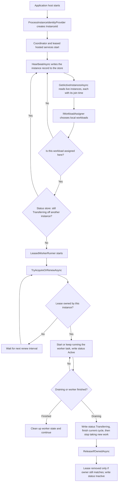

# Leader election flow

This library keeps singleton (or evenly sharded) background work running on
exactly the right instances at a time. It uses three storage-backed concerns,
each defined here as an interface a consumer implements against its own store:

- an **instance registry** (`IInstanceRegistry`) that records which application
  processes are alive
- a **lease manager** (`ILeaseManager`) that grants one instance ownership of a
  named workload
- a **workload status store** (`IWorkloadStatusStore`) that tracks each
  workload's `Active` / `Transferring` / `Inactive` lifecycle state, so a
  coordinator can avoid starting a workload that's still finishing up elsewhere

## Main lifecycle

## What each part does

### Instance identity
`ProcessInstanceIdentityProvider` gives each process a unique id. That id is used everywhere the instance needs to prove ownership.

### Instance registry
A consumer's `IInstanceRegistry` implementation stores a heartbeat record with a TTL, plus a write-once join time captured the first time each instance id is ever seen (never touched by later heartbeat renewals). A coordinator uses that list - each entry an `ActiveInstance` with an `InstanceId` and `JoinedAtUtc` - to know which instances are still active, and how long each has been around. (A Redis-backed example would write a keyed record with TTL, a separate `NX`-guarded field for the join time, and read back a secondary index of live keys; any store that supports expiring records and a membership query works.)

### Lease manager
A consumer's `ILeaseManager` implementation protects each named workload with mutual exclusion around a lease record — for example a short arbitration lock plus a read-then-write of the lease record. A lease can be renewed by the same owner, but not stolen by another owner before it expires.

### Workload status store
A consumer's `IWorkloadStatusStore` implementation records each workload's `WorkloadStatus` (`Active` / `Transferring` / `Inactive`), each write carrying its own TTL. `LeasedWorkerRunner` writes `Active` every `renewInterval` while it owns the lease and the worker is running — doubling as that workload's own heartbeat — `Transferring` for the whole drain wind-down (TTL-bounded by `drainTimeout`), and `Inactive` once it actually releases the lease. `WorkloadCoordinatorHostedService<TWorkload>` reads this before starting a newly assigned workload: one still `Transferring` off another instance is left for a later tick instead of spinning up a runner that would just poll for a lease it can't get yet. This is a liveness/efficiency short-circuit layered on the lease, not a replacement for it — a stale or missing status record never causes a double-run, because the lease underneath still arbitrates ownership either way.

### Leased worker runner
`LeasedWorkerRunner` is the loop that actually runs a workload. It:

1. tries to acquire or renew the lease
2. starts the worker only when the lease is owned
3. switches into drain mode when its `stoppingToken` is cancelled (reassigned, or the whole host shutting down - it can't tell which, and doesn't need to) or when `IInstanceRegistry.IsDraining` is already true (an operator drained the instance externally), calling `RequestDrain()` on the workload's `IDrainableService` (if it supplied one) the moment that happens
4. lets the current cycle finish, then stops taking new work
5. releases the lease once it actually stops

It never calls `IInstanceRegistry.BeginDrainAsync` itself, regardless of which of those triggered
the wind-down - see [Draining](#draining) below.

### Coordinator
For workloads beyond a single singleton, `WorkloadCoordinatorHostedService<TWorkload>` keeps
heartbeats alive, reads active instances, uses its `IWorkloadAssigner` (`BalancedNamedWorkloadAssigner`
by default, or `PrimaryNodeWorkloadAssigner` for an active/passive topology) to decide which
workloads belong to this instance, and reconciles one `LeasedWorkerRunner` per assigned workload —
starting runners for newly assigned workloads and stopping ones that dropped out. Each runner gets
its own `CancellationTokenSource`, *linked* to the coordinator's host token via
`CancellationTokenSource.CreateLinkedTokenSource` and driven with the single-parameter
`LeasedWorkerRunner.RunAsync(stoppingToken)`: cancelling the per-runner source alone (the coordinator
removing just that one workload) or the host token (the whole instance shutting down, which cancels
every linked source at once) fires the same token the runner watches - it never needs to know which
caused it, since it treats both identically.

A workload dropping out of this instance's assignment always gets the same graceful treatment,
regardless of *why* it dropped out - reassigned elsewhere, or the whole instance shutting down:
- runner still running → left to finish on its own, up to `drainTimeout`; neither case ever marks
  the whole instance draining in the backing store, that stays an explicit external act (see
  [Draining](#draining))
- runner already finished → cleaned up without cancelling

Cancelling a runner's `CancellationTokenSource` is what starts this wind-down, but the coordinator
never awaits it inline — it's fire-and-forget from the coordinator's perspective (`Cancel()` is
idempotent, so calling it again on a later tick while the runner is still finishing is harmless).
Blocking the coordinator's own tick loop on a single still-running runner would stall this
instance's own heartbeat for as long as that runner takes to wind down, which could make the rest
of the fleet see a perfectly healthy instance as dead — so a removed-but-still-running runner is
simply left alone and picked up (or force-stopped past `drainTimeout`) on a later tick.

Workload construction and execution stay entirely in the `executeAsync` delegate a consumer
supplies (it knows how to construct and run each workload) — that piece is domain-specific and
lives in the consuming application, not in this library.

### Draining
Marking the whole instance draining (`IInstanceRegistry.BeginDrainAsync`) is always a deliberate,
external act - a `/drain`-style endpoint or a preStop hook calling it directly - never something
`LeasedWorkerRunner` or `WorkloadCoordinatorHostedService<TWorkload>` infer and do on their own from
a cancelled token. Once called, other nodes stop assigning new workloads to that instance (see
`GetActiveInstancesAsync`, which excludes draining instances). Independently of that, each
`LeasedWorkerRunner` keeps its current worker running until it reaches a safe boundary and exits on
its own, up to a `drainTimeout` ceiling, whenever its own `stoppingToken` is cancelled *or*
`IInstanceRegistry.IsDraining` is already true - only once that ceiling is hit does the runner
force-cancel the worker. This is what lets an instance hand its in-flight work over cleanly instead
of dropping it, whether the cause was a plain reassignment or the whole instance going away. A bare
host shutdown with no prior `BeginDrainAsync` call still winds every workload down this same way; it
just doesn't proactively exclude the instance from new assignments until its heartbeat expires -
call the drain endpoint first if you want that to happen immediately.

A workload doesn't have to depend on `IInstanceRegistry` to find out it should wrap up. If it
implements `IDrainableService`, the runner calls `RequestDrain()` on it the instant drain mode is
entered — well ahead of `drainTimeout` — so the workload only needs to know "stop after the current
unit of work", not anything about leases or instance registries.

## Result

At runtime, the cluster converges on one active owner per singleton workload. If an instance dies, its heartbeat expires, the workload is reassigned, and the new owner starts the worker after taking the lease.
