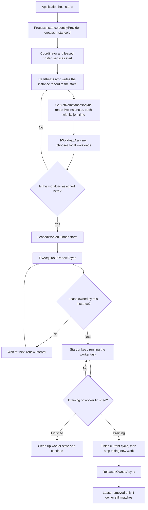

# Leader election flow

This library keeps singleton (or evenly sharded) background work running on
exactly the right instances at a time. It uses two storage-backed concerns,
each defined here as an interface a consumer implements against its own store:

- an **instance registry** (`IInstanceRegistry`) that records which application
  processes are alive
- a **lease manager** (`ILeaseManager`) that grants one instance ownership of a
  named workload

## Main lifecycle

## What each part does

### Instance identity
`ProcessInstanceIdentityProvider` gives each process a unique id. That id is used everywhere the instance needs to prove ownership.

### Instance registry
A consumer's `IInstanceRegistry` implementation stores a heartbeat record with a TTL, plus a write-once join time captured the first time each instance id is ever seen (never touched by later heartbeat renewals). A coordinator uses that list - each entry an `ActiveInstance` with an `InstanceId` and `JoinedAtUtc` - to know which instances are still active, and how long each has been around. (A Redis-backed example would write a keyed record with TTL, a separate `NX`-guarded field for the join time, and read back a secondary index of live keys; any store that supports expiring records and a membership query works.)

### Lease manager
A consumer's `ILeaseManager` implementation protects each named workload with mutual exclusion around a lease record — for example a short arbitration lock plus a read-then-write of the lease record. A lease can be renewed by the same owner, but not stolen by another owner before it expires.

### Leased worker runner
`LeasedWorkerRunner` is the loop that actually runs a workload. It:

1. tries to acquire or renew the lease
2. starts the worker only when the lease is owned
3. switches into drain mode on shutdown (or whenever `IInstanceRegistry.IsDraining` becomes true for any other reason), calling `RequestDrain()` on the workload's `IDrainableService` (if it supplied one) the moment that happens
4. lets the current cycle finish, then stops taking new work
5. releases the lease during shutdown

### Coordinator
For workloads beyond a single singleton, `WorkloadCoordinatorHostedService<TWorkload>` keeps
heartbeats alive, reads active instances, uses its `IWorkloadAssigner` (`BalancedNamedWorkloadAssigner`
by default, or `PrimaryNodeWorkloadAssigner` for an active/passive topology) to decide which
workloads belong to this instance, and reconciles one `LeasedWorkerRunner` per assigned workload —
starting runners for newly assigned workloads and stopping ones that dropped out. Each runner gets
its own `CancellationTokenSource`, independent of the coordinator's host token, and is driven with
`LeasedWorkerRunner.RunAsync(stoppingToken, shutdownToken)`: the per-runner token as `stoppingToken`
(cancelled when the coordinator removes just that runner) and the host token as `shutdownToken`
(cancelled when the whole instance shuts down) — this is what lets one workload being reassigned
stay a purely local event instead of draining the whole instance.

A workload dropping out of this instance's assignment always gets the same graceful treatment,
regardless of *why* it dropped out — the only thing that differs is whether the whole instance
gets marked draining in the backing store:
- runner still running, instance draining (real shutdown or an external drain request) → left to
  finish on its own, up to `drainTimeout`; the instance *is* marked draining
- runner still running, plain rebalance (instance itself still healthy) → left to finish on its
  own the same way, up to the same `drainTimeout`; the instance is *not* marked draining
- runner already finished → cleaned up without cancelling

Cancelling a runner's `CancellationTokenSource` is what starts this wind-down, but the coordinator
never awaits it inline — it's fire-and-forget from the coordinator's perspective (`Cancel()` is
idempotent, so calling it again on a later tick while the runner is still finishing is harmless).
Blocking the coordinator's own tick loop on a single still-running runner would stall this
instance's own heartbeat for as long as that runner takes to wind down, which could make the rest
of the fleet see a perfectly healthy instance as dead — so a removed-but-still-running runner is
simply left alone and picked up (or force-stopped past `drainTimeout`) on a later tick.

Workload construction and execution stay entirely in the `executeAsync` delegate a consumer
supplies (it knows how to construct and run each workload) — that piece is domain-specific and
lives in the consuming application, not in this library.

### Draining
When an instance begins draining — because its host is shutting down, or because something else flips `IInstanceRegistry.IsDraining` ahead of a planned downsize — the backing store should mark that instance's record so other nodes stop assigning new workloads to it (see `GetActiveInstancesAsync`, which excludes draining instances). Each `LeasedWorkerRunner` for that instance keeps its current worker running until it reaches a safe boundary and exits on its own, up to a `drainTimeout` ceiling; only once that ceiling is hit does the runner force-cancel the worker. This is what lets an instance hand its in-flight work over cleanly instead of dropping it when the cluster is downsized. A plain reassignment (the coordinator moving a workload to another instance while this one stays healthy) goes through the exact same `drainTimeout`-bounded wind-down inside `LeasedWorkerRunner` — it just never marks the instance itself as draining.

A workload doesn't have to depend on `IInstanceRegistry` to find out it should wrap up. If it
implements `IDrainableService`, the runner calls `RequestDrain()` on it the instant drain mode is
entered — well ahead of `drainTimeout` — so the workload only needs to know "stop after the current
unit of work", not anything about leases or instance registries.

## Result

At runtime, the cluster converges on one active owner per singleton workload. If an instance dies, its heartbeat expires, the workload is reassigned, and the new owner starts the worker after taking the lease.
