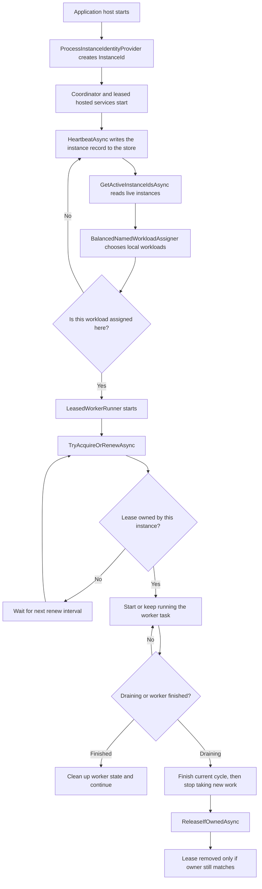

# Leader election flow

This library keeps singleton (or evenly sharded) background work running on
exactly the right instances at a time. It uses two storage-backed concerns,
each defined here as an interface a consumer implements against its own store:

- an **instance registry** (`IInstanceRegistry`) that records which application
  processes are alive
- a **lease manager** (`ILeaseManager`) that grants one instance ownership of a
  named workload

## Main lifecycle

## What each part does

### Instance identity
`ProcessInstanceIdentityProvider` gives each process a unique id. That id is used everywhere the instance needs to prove ownership.

### Instance registry
A consumer's `IInstanceRegistry` implementation stores a heartbeat record with a TTL. A coordinator uses that list to know which instances are still active. (A Redis-backed example would write a keyed record with TTL and read back a secondary index of live keys; any store that supports expiring records and a membership query works.)

### Lease manager
A consumer's `ILeaseManager` implementation protects each named workload with mutual exclusion around a lease record — for example a short arbitration lock plus a read-then-write of the lease record. A lease can be renewed by the same owner, but not stolen by another owner before it expires.

### Leased worker runner
`LeasedWorkerRunner` is the loop that actually runs a workload. It:

1. tries to acquire or renew the lease
2. starts the worker only when the lease is owned
3. switches into drain mode on shutdown (or whenever `IInstanceRegistry.IsDraining` becomes true for any other reason)
4. lets the current cycle finish, then stops taking new work
5. releases the lease during shutdown

### Coordinator (consumer-provided)
For workloads beyond a single singleton, a consumer writes its own coordinator hosted service that keeps heartbeats alive, reads active instances, uses `BalancedNamedWorkloadAssigner` to decide which of its own domain-specific workloads belong to this instance, and starts one `LeasedWorkerRunner` per assigned workload. That coordinator is domain-specific (it knows how to construct and run each workload) and lives in the consuming application, not in this library. A drain-aware coordinator should also: stop reassigning a draining instance's own workloads elsewhere until it actually stops (`GetActiveInstanceIdsAsync` already excludes draining instances for *other* nodes' assignment decisions), and wait for its own runners to reach a safe stopping point during its own shutdown instead of cancelling them outright.

### Draining
When an instance begins draining — because its host is shutting down, or because something else flips `IInstanceRegistry.IsDraining` ahead of a planned downsize — the backing store should mark that instance's record so other nodes stop assigning new workloads to it (see `GetActiveInstanceIdsAsync`, which excludes draining instances). Each `LeasedWorkerRunner` for that instance keeps its current worker running until it reaches a safe boundary and exits on its own, up to a `drainTimeout` ceiling; only once that ceiling is hit does the runner force-cancel the worker. This is what lets an instance hand its in-flight work over cleanly instead of dropping it when the cluster is downsized.

## Result

At runtime, the cluster converges on one active owner per singleton workload. If an instance dies, its heartbeat expires, the workload is reassigned, and the new owner starts the worker after taking the lease.
